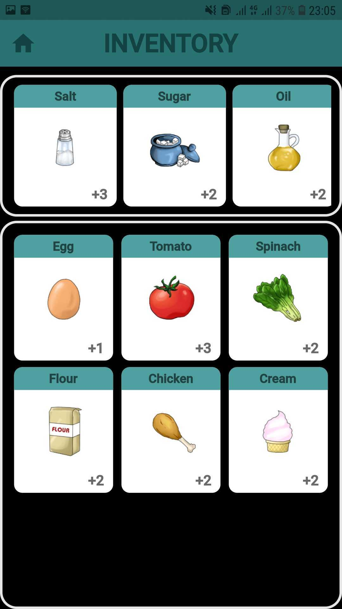

# About the app:
Calorun is a social media that brings people who love running together. With Calorun, you can track your route, distance, time, and calories burnt. You can show your profile, photos, or running records to your friends. Besides, Calorun has a game that everyone can play. You can earn in-game currency from running.

# System requirement:
The application is designed to be used on Android devices with Android version 4.1 and newer.

# Installing:
- *Step 1*: Download "calorun.apk" file in folder \release.
- *Step 2*: Install the app. Make sure that your device allows applications from outside the Google Play Store to be installed.
- *Step 3*: Enjoy the Calorun and have a nice run. 

# How to use:
You can create an account by following these super-simple steps:

  
Or, in case you had an account, you can log in to Calorun by:

  
## Homepage:
When you have successfully logged in, you will see your timeline, where you can see posts from people you are following.

You can tap on the like button or double-tap on the photo to send a "like" to the post's owner.

## Search bar:
You can search for other users by clicking the "magnifying glass icon":

In other users' profiles, you can choose to follow them. In that way, you can see their posts in your timeline.

## Run recorder:
When you start recording, you can keep track of your route, distance, time, and calories that you have burnt.

   
## Leaderboard:
This is where you can see top-ranking runners and your rank.

## Game: 
You can earn in-game currency whose name is Tuna to exchange for game items. 

#### *Main screen*: 
You can see your cat's information and status after clicking on the cat:

There are three buttons: Inventory button, Cookbook button and Shop button.

#### *Inventory*:
This is where you can see your ingredient collection.

#### *Cookbook*:
You can see all the dishes available to cook and their required ingredients.

#### *Shop*:
You can buy more spice (basic ingredients) or play gacha to get raw materials (common, uncommon and rare ingredients).

#### *Kitchen*: 
In the cookbook screens, click on the cook button of a dish, and you will be led to the kitchen. All you need to do is follow the instruction. Finish your dish by clicking on the "Feed" button. "Calo the cat" will eat and evaluate your cooking skill.

## User profile:
You can change your profile and see your posts here. Make sure you add your height and weight so that Calorun can estimate your calories burned during the running session.

# Demo video: 
Link: [Click here to be redirected to Youtube (turn on English caption if needed)](https://youtu.be/tboAApmBuww)

# Technology used:
[Dart](https://dart.dev/)/[Flutter](https://flutter.dev/)

[Firebase](https://firebase.google.com/)

[OpenStreetMap](https://www.openstreetmap.org/)

